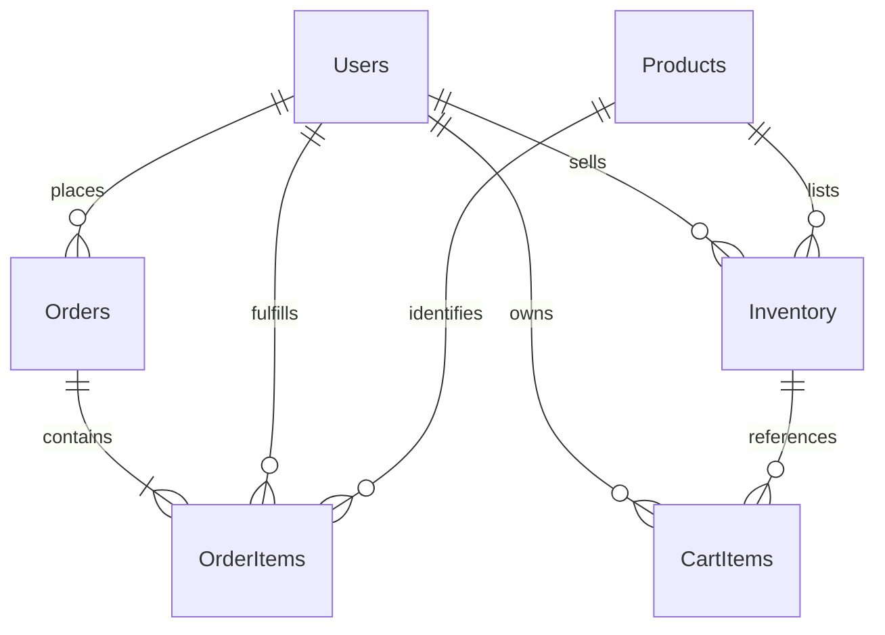
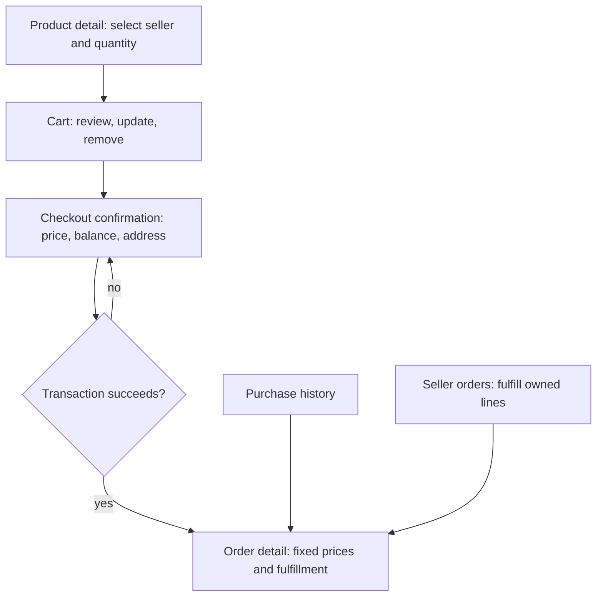

# Cart / Order diagrams (proposed design)

## Relationships

Every order contains at least one item by checkout application logic, not by an ordinary foreign key alone. Inventory uses (seller_id, product_id); CartItems uses (buyer_id, seller_id, product_id); OrderItems uses (order_id, seller_id, product_id). Empty carts have no rows. OrderItems does not depend on live Inventory. All nullable/required fields and checks are specified in CARTS_DESIGN.md and db/carts_schema.sql.

## Planned navigation

The seller link above indicates that fulfillment updates the buyer's status; sellers do not enter the buyer-only detail page. Guests must log in before cart/checkout; all mutations are authenticated POSTs with CSRF checks. Only the cart read page is implemented today.
