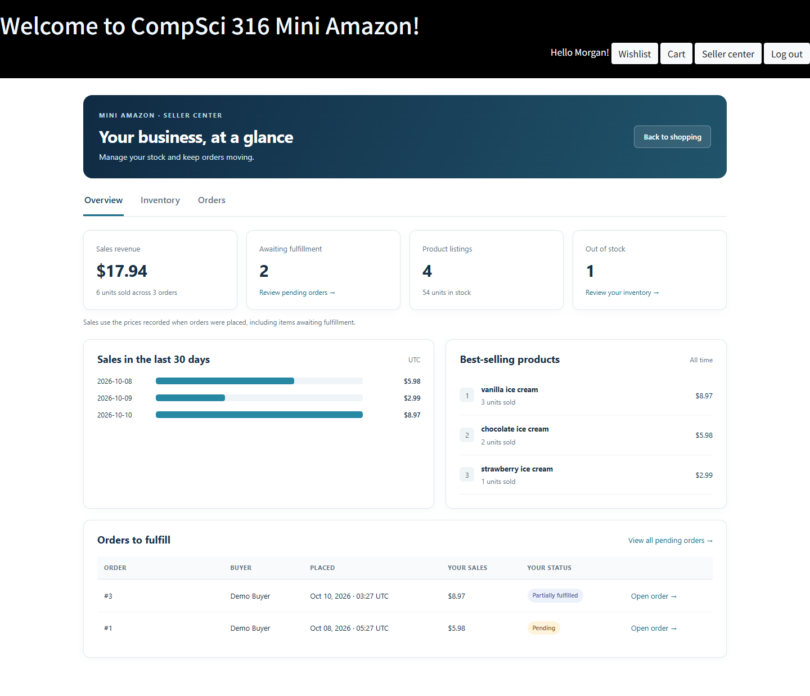
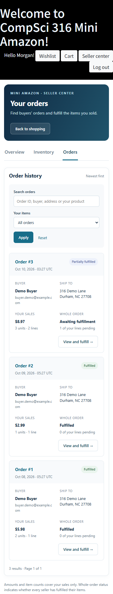

# Sellers validation — 2026-10-10

The tested implementation builds on Carts commit
`a80a10f6f9142e5af2c74ee5e794ba38baf3abc8`.
Validation used Python 3.12.14, Flask 2.3.3, Werkzeug 2.3.7 and PostgreSQL 16.15.
The database and server ran locally; no course or team database was reset.

## Automated checks

All 41 tests passed: 11 existing Cart/Wishlist tests, 20 Sellers tests and 10
native PostgreSQL tests. Coverage includes authenticated identity, CSRF, invalid
quantities, literal searches, page boundaries, snapshot escaping, multi-seller
privacy, listing removal preserving carts/history, idempotent fulfillment and
bounded transaction retries.

Native PostgreSQL checks cover constraints and transaction rollback, simultaneous
stock edits, simultaneous fulfillment, repeatable additive migration, refusal to
initialize an existing database, and UTC revenue grouping with a New York server
timezone. The two concurrent stock edits produced one success and one conflict.
The two concurrent fulfillments returned one original timestamp without changing
stock or balances.

A synthetic set of 10,003 owned orders returned a page of 20 in 0.040 seconds on
this validation host. The other seller still saw only their two orders. This is
a local test observation, not a production performance guarantee.

Default suite:

```bash
poetry run python -m unittest discover -s tests -v
```

This executes 31 checks and skips the 10 opt-in native tests. For native tests,
first create a **separate new verification database** using the same local
PostgreSQL configuration as the application:

```bash
poetry run python tools/setup_sellers.py --database mini_amazon_sellers_verify_local --no-config
export SELLERS_POSTGRES_TEST=1
export SELLERS_TEST_DB=mini_amazon_sellers_verify_local
poetry run python -m unittest discover -s tests -p test_sellers_postgres.py -v
```

The native suite accepts only `mini_amazon_sellers_verify_*` and checks the
connected database name before truncating its fixtures. It resets only that test
database. Do not point it at application data. Run native tests separately from
the fast suite, or export actual `DB_*` connection variables before running all
41 together; existing fast tests supply dummy defaults during import.

Fresh demo initialization, password login and the existing-database refusal were
also exercised. `python -m compileall -q app tools` and `git diff --check` passed.

## Browser and visual checks

Microsoft Edge's Chromium engine 154.0.4258.62 ran the live Flask/PostgreSQL app
at desktop 1440×1000 and phone 390×844 viewports. Browser automation exercised
password login, navigation, quantity saves, catalog add/removal confirmation,
search, each seller's fulfillment, whole-order status and the teammate's cart.
The phone flow also saved stock and fulfilled an order item through the UI.

Rendered pages were visually inspected. Verification caught and fixed the
skeleton's global white section text leaking into Seller panels and an absolutely
positioned table label causing horizontal page overflow. Narrow tables scroll
inside their own container; the page does not overflow horizontally. Application
responses had no HTTP 500 errors and the browser recorded no page errors.

Screenshots use only synthetic demo accounts and orders:





## Remaining team work

The full purchase-to-fulfillment flow needs the Carts checkout implementation and
the final Users/Products modules. The current orders are synthetic fixtures;
this validation does not claim production deployment or real checkout coverage.
After those modules merge, run a real purchase with multiple sellers and verify
the stock, balances, immutable order snapshots and buyer-visible fulfillment.
